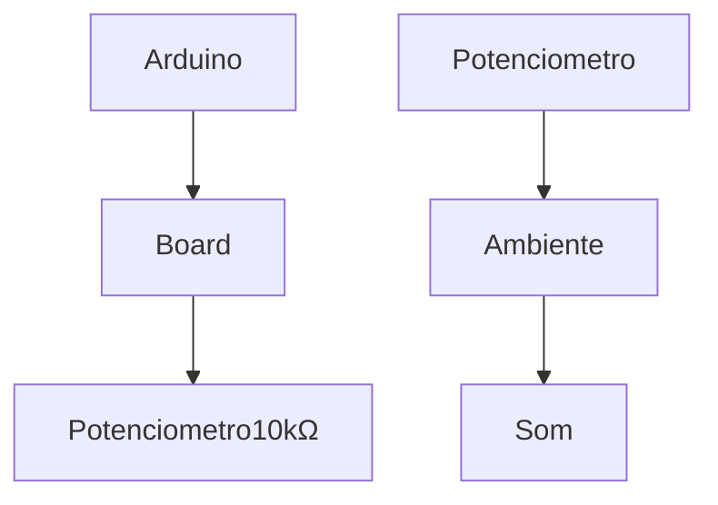

# LedResponsive
Led Rítmico Responsivo com o movimento e modo de movimento

```mermaid    
graph TD;
    Arduino-->Board;
    Board-->Potenciometro10kΩ;
    Potenciometro-->Ambiente;
    Ambiente-->Som;
```

- [X] Arduino Mega 2560
- [X] Código
- [X] Fita de led 1 Metro
- [X] Potenciometro
