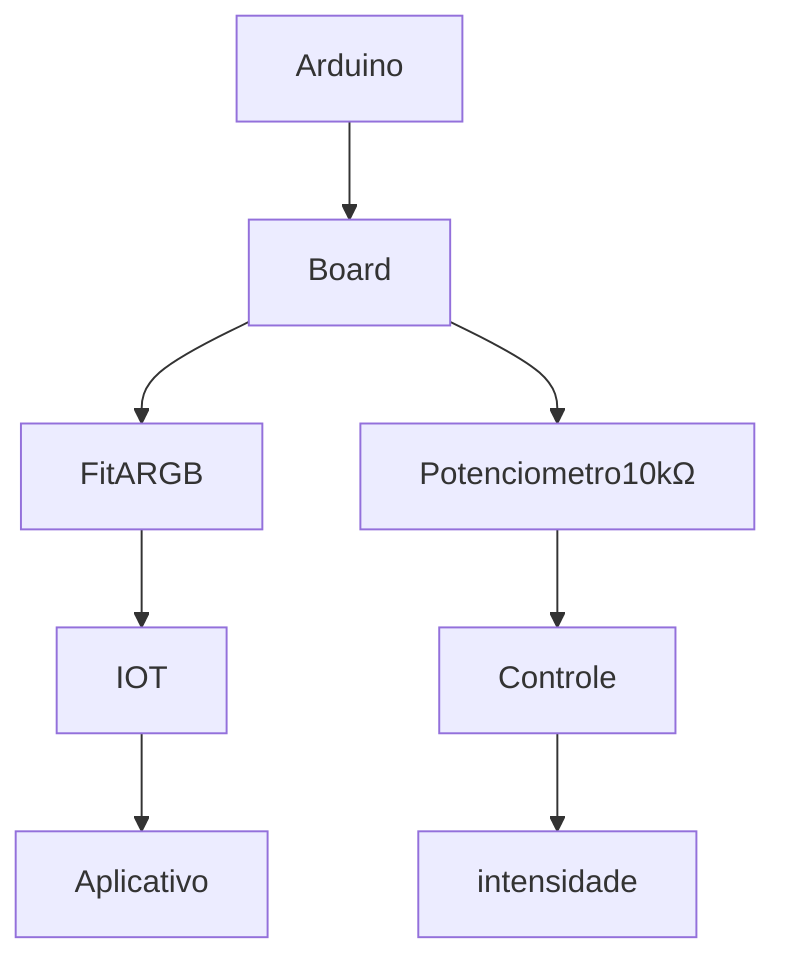

# LedResponsive
Led Rítmico Responsivo com o *som* e modo de *movimento*

- **Tendência inicial**

- [X] Arduino Uno
- [X] Código
- [X] Biblioteca fastLED + NeoPixel
- [X] Fita de led 1 Metro
- [X] Potenciometro

## Bibliotecas inclusas
`#include <Adafruit_NeoPixel_ZeroDMA.h>
#include <bittable.h>
#include <pins.h>
#include <FastLED.h>
#include <Adafruit_NeoPixel.h>`