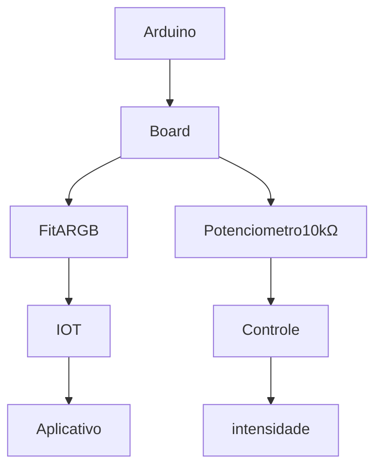

# LedResponsive
Led Rítmico Responsivo com o movimento e modo de movimento

- **Tendência inicial**

- [X] Arduino Uno
- [X] Código
- [X] Biblioteca fastLED + NeoPixel
- [X] Fita de led 1 Metro
- [X] Potenciometro
